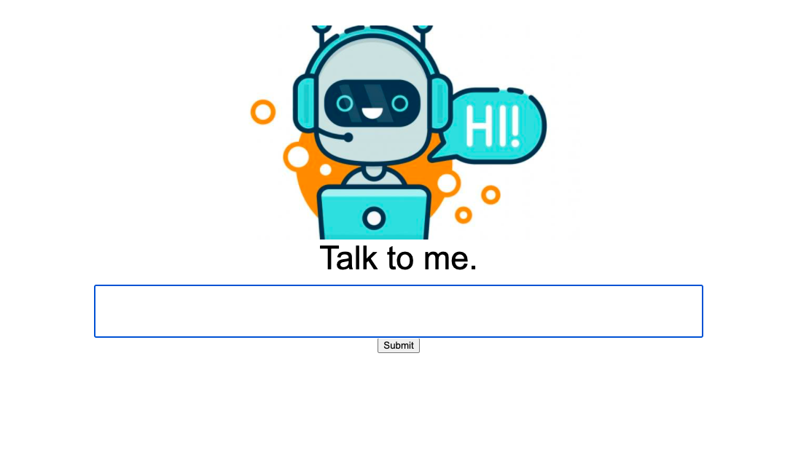

# Simple ChatBot with Python and Google Search
Build a simple ChatBot with Python that uses a webscraper which runs on an algorithm 
to perform a Google Search of a user’s query, scrape the text from the first result, 
and reply to the user with the first sentence of that page’s text.
The app consists of a Python 3 server and a web interface.



## Install
Clone the repo using command line and cd into the app.

```pip install -r requirements.txt```

## Run

```python server.py```

Open a browser and go to localhost:8080.